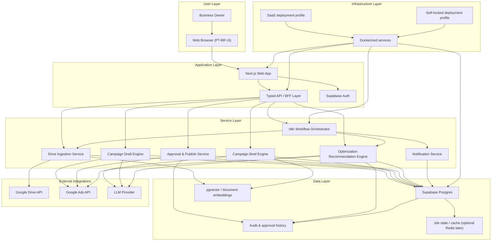

# Epic Architecture Specification: Google Ads Copilot for Business Owners

## 1. Epic Architecture Overview

The MVP architecture should optimize for clarity, approval-based safety, and fast iteration over a small but valuable feature set. The recommended shape is a web application with a minimal PT-BR UI, a typed backend for product APIs, an AI orchestration layer for extraction and campaign generation, and workflow automation for recurring tasks such as ingestion and optimization analysis. The system should treat Google Drive as the source of campaign context and Google Ads as the execution surface, while keeping all approval and audit state inside the product's own database.

For the MVP, the architecture should prefer a modular monolith with clear domain boundaries over a distributed microservice fleet. This keeps delivery speed high while allowing later separation of workers and automation flows. The app should support SaaS-first deployment, but keep container boundaries clean enough to support self-hosted deployments later if the product direction requires it.

## 2. System Architecture Diagram

## 3. High-Level Features & Technical Enablers

### High-Level Features

- Workspace onboarding with Google Ads and Google Drive connections
- Drive folder selection and campaign context ingestion
- Campaign brief normalization and readiness scoring
- Search campaign draft generation with explainability
- Approval-based publishing workflow
- Optimization recommendation center with approval loop
- Audit trail for drafts, approvals, publications, and optimizations

### Technical Enablers

- OAuth integrations for Google Ads and Google Drive
- Central domain model for workspaces, integrations, briefs, drafts, recommendations, and audit events
- Background execution model for ingestion, draft generation, and optimization routines
- AI prompt templates and evaluation layer for extraction, drafting, and optimization reasoning
- Job orchestration with n8n for scheduled and event-driven workflows
- Embedding-backed retrieval for long-form campaign materials
- Guardrail engine for budget limits, geography constraints, and forbidden terms
- Structured observability and failure tracking

## 4. Technology Stack

### Frontend

- Next.js with App Router
- TypeScript
- Minimal design system for PT-BR product flows
- Server components plus client interactions where approval workflows need immediate feedback

### Product API and Domain Layer

- Next.js backend routes or typed API layer
- TypeScript domain modules for:
  - Workspace & onboarding
  - Integrations
  - Drive ingestion
  - Campaign brief
  - Draft generation
  - Approval & publishing
  - Optimization recommendations
  - Audit & guardrails

### Data and Persistence

- Supabase Postgres as primary application database
- pgvector for document chunk embeddings and retrieval
- Supabase Auth for MVP user authentication
- Optional Redis later if job throughput or caching requires it

### Automation and Background Work

- n8n for scheduled workflows, orchestration, and async job coordination
- Background worker process for AI-heavy tasks and Google Ads operations when request/response latency would be too high

### AI and Decisioning

- LLM provider for:
  - document extraction
  - brief generation
  - campaign draft generation
  - recommendation rationale
- Prompt and evaluation versioning stored with artifact metadata

### External Integrations

- Google Drive API
- Google Ads API

### Deployment

- Docker for all services
- SaaS-first deployment profile for the MVP
- Clean service boundaries so the same components can be self-hosted later

## 5. Technical Value

**High**

This architecture has high technical value because it supports the full product promise without prematurely over-distributing the system. It preserves fast MVP delivery by using a modular application core while still creating the right seams for later scale-out into heavier workers, broader automation, and multi-country support. It also keeps the most sensitive flows, approvals, publication, and auditability, under product control instead of hiding them inside external automation only.

## 6. T-Shirt Size Estimate

**XL**

Even with a constrained MVP, this epic includes multiple external integrations, AI-assisted decisioning, approval-driven operations, recurring optimization jobs, and audit requirements. The architecture is still manageable as a modular monolith plus workflow engine, but the cross-cutting concerns make the overall epic large.

## Recommended Technical Shape for MVP

- `apps/web`: Next.js product UI and product API endpoints
- `apps/worker`: background execution for ingestion, draft generation, publish/apply jobs, and optimization analysis
- `packages/domain`: typed business rules and entities
- `packages/integrations`: Google Ads, Google Drive, and LLM clients
- `packages/ui`: shared components for the minimal PT-BR frontend
- `packages/prompts`: prompt templates and evaluation metadata

## Recommended Delivery Sequencing

1. Build `apps/web` plus core domain model and auth.
2. Add Google Ads and Google Drive integrations.
3. Implement Drive ingestion and campaign brief pipeline.
4. Implement Search campaign draft generation.
5. Add approval, publishing, and audit.
6. Add optimization jobs and recommendation center.

## Architecture Notes

- For MVP, keep campaign type scope limited to Search to reduce branching complexity.
- Keep all state transitions explicit: `draft`, `ready_for_review`, `approved`, `published`, `recommendation_pending`, `recommendation_approved`, `applied`, `rejected`, `failed`.
- Store every AI-produced artifact with input references, output summary, confidence marker, and timestamp.
- Treat n8n as orchestration, not the source of truth. The application database should own business state.
- Design all UI strings and data models with future multi-country support in mind, but keep the first release PT-BR only.
